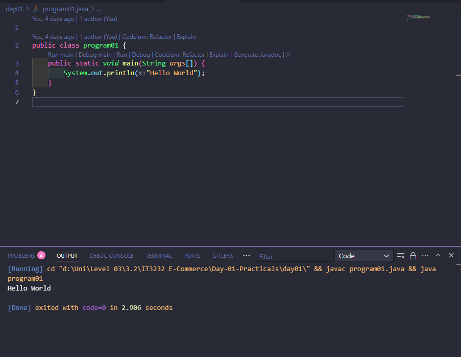

# Day 01 Practicals - Java Fundamentals for Spring Boot 🚀

## Overview 📘

The Day 01 practicals are designed to strengthen core Java programming skills, which are essential for understanding and working with Spring Boot. These exercises focus on object-oriented programming (OOP) concepts, problem-solving, and Java syntax.

## Topics Covered 📝

1. **Basic Java Syntax**:

   - Input and output handling using `Scanner`.
   - Loops (`for`, `while`) and conditional statements (`if`, `else`).

2. **Object-Oriented Programming (OOP)**:

   - 🔒 **Encapsulation**: Using private fields and public getters/setters.
   - 🧬 **Inheritance**: Creating class hierarchies to reuse and extend functionality.
   - 🎭 **Polymorphism**: Overriding methods to provide specific implementations.
   - 🏗️ **Abstraction**: Using abstract classes to define common behavior.

3. **Data Structures**:
   - Arrays for storing and manipulating data.

## Practical Exercises 💡

1. **Reversing a Sequence**:

   - Demonstrates the use of loops and arrays to manipulate data.
   - Focuses on logical thinking and algorithm design.

2. **Library System**:

   - Implements OOP concepts like inheritance and polymorphism.
   - Models real-world entities (e.g., books) in a programmatic way.

3. **Retail Store**:

   - Demonstrates encapsulation and abstraction.
   - Uses arrays to store and display product details.

   ## Problem Specification and Outputs 🖥️

   ### 1. Basic Hello World Program

   ### Problem Specification : **A Basic Java program that prints HelloWorld**

   ### Output:

   

   ***

   ### 2. Basic for loop Program

   ### Problem Specification : **A Basic Java program that prints a For loop from 01 to 09**

   ### Output:

   ()

   ***

   ### 3. Reverse a Number

   ### Problem Specification : **A Java Program to reverse a Number**

   ### Output:

   ()

   ***

   ### 4. Prints odd numbers from 1 to 20

   ### Problem Specification : **A Java Program to Prints Odd numbers from 1 to 20**

   ### Output:

   ()

   ***

   ### 5. Program 05

   ### Problem Specification : **Write a Java program that takes an integer N as input and prints numbers from 1 to N but with two reversed parts:**

   - The first half (1 to N/2) should be printed in reverse order.
   - The Second half (((N/2))+1 to N) should also be printed in reverse order

   ### Output:

   ()

   ***

   ### 6. Program 06

   ### Problem Specification : **Write a Java program that Creates 5 student objects and stores them in a suitable data structure and Calculate the average marks of students**

   ### Output:

   ()

   ***

   ### 7. Program 07

   ### Problem Specification : **Create a Java program to implement a Library system with different types of books: Printed Books, E-Books, AudioBooks. (Use Inheritance encapsulation and Polymorphism when necessary)**

   ### Output:

   ()

   ***

   ### 8. Program 08

   ### Problem Specification : **Implement a Retail Store system in Java that can manage multiple products such as fruits, vegetables, and grocery items.Display the available products with their details (name, price, and quantity).**

   ### Output:

   ()

   ***

## Purpose 🎯

These exercises serve as a foundation for:

- Understanding the principles of OOP, which are heavily used in Spring Boot.
- Writing clean, modular, and reusable code.
- Preparing for more advanced topics like dependency injection, REST APIs, and database integration in Spring Boot.
